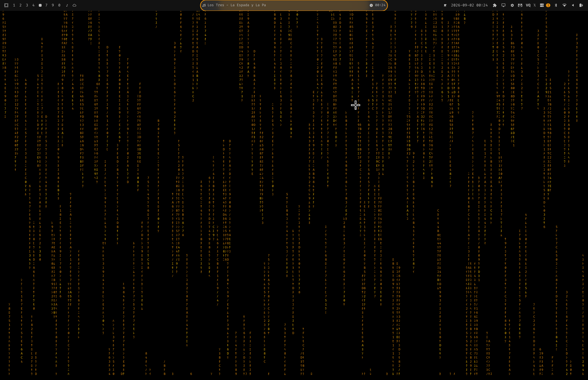

# Omarchy Audio Background

[](https://x.com/avillagran/status/2094998179628409318?s=20)

> **NOTE:** There are bugs. Please report them!

Animated, audio-reactive **desktop background** for [Omarchy](https://omarchy.org) / Hyprland, controlled from the Omarchy bar. It renders as a real Wayland `layer-shell` background that lives *below* app windows and the bar.

## Install

```sh
omarchy plugin add https://github.com/avillagran/omarchy-audio-background.git --enable --yes
```

Then restart the shell so the bar widget and service load:

```sh
omarchy-restart-shell
```

Left-click the ♪ bar icon to open the config panel.

## What it does

- One Rust binary opens a `WlrLayer.Background` window per monitor and draws the active effect inside a Vte terminal.
- Audio is captured from the default sink monitor (`parec`) and analyzed into volume, beat and per-band energy. The animation speed, brightness and color react live to the music.
- The config panel writes `state.json`; the background polls it every ~700 ms, so changes apply without a shell restart.

## Effects

`matrix` · `rain` · `wave` · `bars` · `donut` · `fire` · `starfield` · `life`

Plus a vendored catalog from [`ttfx`](https://github.com/omacom/ttfx): `beams`, `blackhole`, `bubbles`, `burn`, `colorshift`, `fireworks`, `rings`, `synthgrid`, `thunderstorm`, `vhstape`, `swarm`, `spray`.

Enable any subset in the panel; with more than one enabled the active effect rotates every 20 s.

## Configuration

Key settings in the panel:

- **Enabled** — turn the background on/off.
- **React to audio** — make the effect move with system audio.
- **Use theme colors** — pick the palette from the active Omarchy theme instead of the built-in effect colors (default on).
- **Effect** — choose and enable/disable individual effects.
- **Intensity** — 0–10, animation speed and trail length.
- **Audio reactivity** — how strongly audio affects speed/brightness/color.
- **Resolution** — render at lower or higher cell density.
- **Intro text** — word shown during the boot splash (default `OMARCHY`).
- **Intro size** — 1–3 scale for the boot splash.
- **Rotate seconds** — how long each effect stays when multiple are enabled.
- **Panel opacity** — transparency of the config card.

## Running as a systemd service

Use this **or** the built-in plugin service, not both:

```sh
cp ttfx-bg.service ~/.config/systemd/user/
systemctl --user daemon-reload
systemctl --user enable --now ttfx-bg.service
```

The unit uses `%h` and `bin/ttfx-bg-launch.sh`, so it works on any install with no edits.

## Local development

```sh
git clone https://github.com/avillagran/omarchy-audio-background.git
cd omarchy-audio-background
ln -sfn "$PWD" ~/.config/omarchy/plugins/io.github.avillagran.omarchy-audio-background
omarchy-shell shell rescanPlugins
```

The prebuilt binaries in `bin/` cover the supported architectures (`aarch64`, `x86_64`). To rebuild manually:

```sh
cd bin/ttfx-bg-rs
cargo build --release
```

## Files

- `bin/ttfx-bg-rs/src/main.rs` — layer-shell host, Vte, state polling, renderer lifecycle.
- `bin/ttfx-bg-rs/src/` + `ttfx-src/` — Rust source and vendored effect engine.
- `BarWidget.qml` — bar icon.
- `Panel.qml` — configuration panel.
- `Service.qml` — plugin service entry point.
- `manifest.json` — plugin manifest.
- `ttfx-bg.service` — optional systemd user service.

## Requirements

- Omarchy / Hyprland on Wayland.
- Same-arch prebuilt binary included; rebuild needs `gtk4`, `gtk4-layer-shell`, `vte4` and `pkg-config`.
